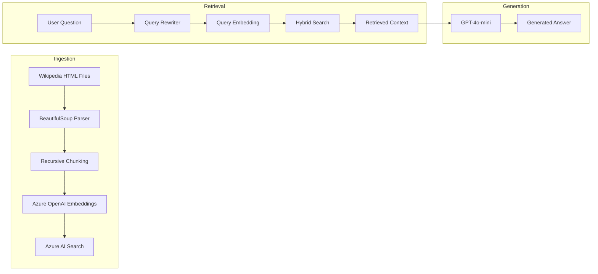
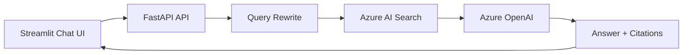
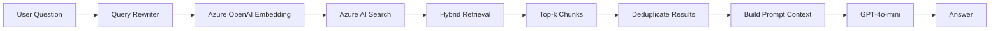

# Azure RAG Demo – Wikipedia Knowledge Base

A production-oriented Retrieval-Augmented Generation (RAG) application built from scratch on Microsoft Azure.

The project demonstrates how to build an end-to-end RAG pipeline without relying on high-level orchestration frameworks such as LangChain or LlamaIndex. Instead, the core components—including ingestion, chunking, retrieval, prompt construction, and answer generation—are implemented directly using Azure SDKs and Python.

The demo corpus consists of locally saved Wikipedia articles about *The Hobbit* and Tolkien's Middle-earth, allowing the application to answer domain-specific questions using grounded retrieval rather than relying solely on the language model's internal knowledge.

The primary objective of this repository is to demonstrate practical cloud engineering and modern data platform development practices, including Infrastructure as Code, secure secret management, vector search, hybrid retrieval, and modular application design.

---

## Features

- Infrastructure deployment using Terraform
- Azure OpenAI integration
- Azure AI Search vector database
- Hybrid retrieval (Vector + Keyword Search)
- Query rewriting
- Custom recursive chunking
- Deterministic ingestion using SHA-256 hashes
- Azure Key Vault integration
- FastAPI REST API
- Modular project architecture
- Configurable retrieval pipeline
- Metadata-aware document indexing

---

## Technology Stack

### Cloud

- Microsoft Azure
- Azure OpenAI
- Azure AI Search
- Azure Key Vault
- Azure Storage Account

### Backend

- Python
- FastAPI
- Pydantic

### Infrastructure

- Terraform

### Data Processing

- BeautifulSoup4
- Azure SDK
- Azure Identity

---

## Suggested Reading Order

For readers interested in understanding the implementation from start to finish, the following order closely follows the application's execution flow.

1. **Terraform** — understand how the Azure environment is provisioned.
2. **Core** — review configuration, Azure clients and shared services.
3. **Loader** — see how raw HTML documents are parsed.
4. **Ingestion** — understand chunking, hashing, embeddings and indexing.
5. **Retrieval** — explore query rewriting and hybrid search.
6. **Generation** — inspect prompt construction and answer generation.
7. **API** — see how the service is exposed through FastAPI.

---

# Architecture Overview



---

# Architecture

The application is organised into two independent workflows:

1. **Ingestion Pipeline** – executed when new documents are added to the knowledge base.
2. **Retrieval Pipeline** – executed for every user question.

Separating these workflows keeps document processing independent from question answering, allowing documents to be ingested once while serving many subsequent queries.

---

# Ingestion Pipeline

The ingestion pipeline transforms raw HTML documents into searchable vector representations stored in Azure AI Search.

Each document passes through the following stages:

1. Parse HTML content
2. Extract the article body
3. Split text into semantic chunks
4. Generate document metadata
5. Calculate deterministic SHA-256 hashes
6. Generate embeddings using Azure OpenAI
7. Upload documents into Azure AI Search
8. Store ingestion metadata



The ingestion process is deterministic and idempotent. If a document has already been processed and its content has not changed, embedding generation and indexing are skipped, reducing both processing time and Azure OpenAI costs.

---

# Retrieval Pipeline

Whenever a user submits a question, the application performs several processing stages before generating a response.

Instead of sending the question directly to the language model, the system first retrieves relevant context from Azure AI Search.

The retrieval pipeline consists of:

1. Query rewriting
2. Query embedding generation
3. Hybrid search
4. Result ranking
5. Context construction
6. Answer generation



This architecture separates retrieval from generation, allowing the language model to answer questions using only information retrieved from the indexed knowledge base.

---

# Request Lifecycle

The following diagram illustrates the complete lifecycle of a single user request.

```text
                    User submits question
                             │
                             ▼
                  Query Rewrite (LLM)
                             │
                             ▼
              Generate Query Embedding
                             │
                             ▼
                Azure AI Search
        (Hybrid Vector + Keyword Search)
                             │
                             ▼
                Retrieve Top-k Chunks
                             │
                             ▼
              Remove Duplicates & Rank
                             │
                             ▼
                Construct Prompt Context
                             │
                             ▼
                  GPT-4o-mini Generation
                             │
                             ▼
                    Generated Answer
```

---

# Azure Services

The project relies entirely on managed Azure services.

| Service | Responsibility |
|----------|----------------|
| **Azure OpenAI** | Generates embeddings and natural language responses |
| **Azure AI Search** | Stores indexed document chunks and performs hybrid retrieval |
| **Azure Key Vault** | Secure storage of API keys and service endpoints |
| **Azure Storage Account** | Storage resources used by the Azure deployment |
| **Terraform** | Infrastructure provisioning and configuration |

---

# Security

The application does not contain hardcoded credentials.

All Azure service endpoints, API keys and deployment configuration are stored inside Azure Key Vault and are retrieved during application startup using Azure SDK clients.

This approach provides:

- centralized secret management
- easier credential rotation
- safer source control
- production-oriented deployment practices

---

# High-Level Design Principles

The project follows several engineering principles throughout its implementation.

### Modular Design

Responsibilities are separated into independent modules:

- Infrastructure
- Ingestion
- Retrieval
- Generation
- API

This keeps components loosely coupled and easier to extend.

---

### Infrastructure as Code

All Azure resources are provisioned using Terraform.

Infrastructure configuration is version controlled alongside application code, making deployments repeatable and reproducible.

---

### Retrieval-Augmented Generation

Rather than relying solely on the language model's pretrained knowledge, answers are generated using retrieved context from Azure AI Search.

This reduces hallucinations while grounding responses in indexed source documents.

---

### Cloud-Native Architecture

The application is designed around managed Azure services, reducing operational overhead while remaining scalable and portable to larger document collections.