# RAG Demo — Azure / Python / Terraform

> **A small-scale RAG application designed to demonstrate enterprise-oriented Data Engineering, Cloud Engineering and AI/LLM engineering principles.**
>
> **Interview walkthrough:** ~10–15 minutes

---

## 1. Why this project?

The goal was not to build a large production system.

Instead, I wanted a **small, understandable RAG application** that demonstrates how I approach an AI application from an engineering perspective:

- **Data Engineering** — ingestion, chunking, embeddings, indexing and deduplication
- **AI / LLM Engineering** — embeddings, retrieval and grounded generation
- **Cloud Engineering** — Azure-managed services
- **Infrastructure as Code** — Terraform
- **Security** — Azure Key Vault for application secrets
- **Software Engineering** — modular architecture and separation of concerns

The dataset is intentionally small. The engineering principles are not.

### Design principles

| Principle | How it is applied |
|---|---|
| **Infrastructure as Code** | Azure resources are defined through Terraform |
| **Separation of layers** | Ingestion, retrieval, generation, API, GUI and infrastructure are separated |
| **Config ≠ app. logic** | Runtime settings are centralized in configuration |
| **Security by design** | Azure credentials/endpoints are retrieved through Key Vault |
| **API serving interface** | The API can serve clients other than Streamlit |


---

## 2. Architecture at a glance

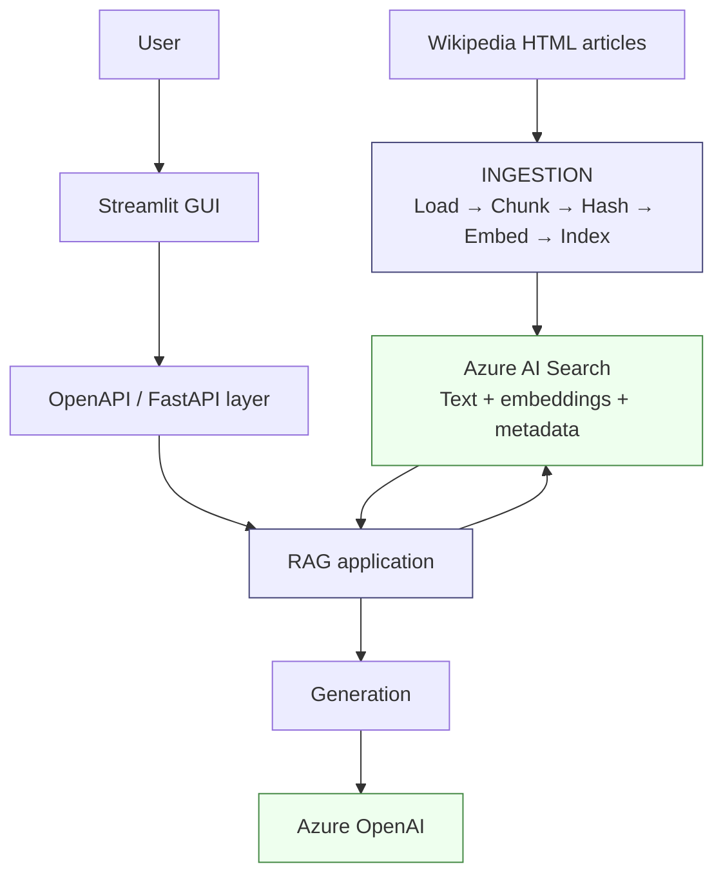

The important architectural boundary is:

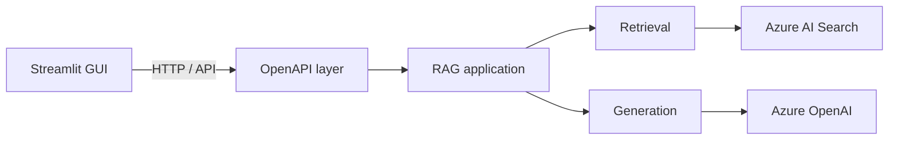

The GUI therefore **does not need to know how the RAG pipeline or Azure infrastructure works**.

This means the same API could later be consumed by another client—for example a Teams bot, another web application, or an automated service.

---

# 3. The data

The demo uses a small collection of **Wikipedia articles about The Hobbit / Middle-earth**.

The repository contains the source URL list under:

```text
data/
├── README.md
└── sources/
    └── wiki_urls.txt
```

The downloaded HTML documents are used as the input to the ingestion pipeline.

### Why Wikipedia?

For a demo, the important thing is not the domain itself.

Wikipedia provides:

- real-world unstructured text
- different article lengths
- headings and paragraphs
- entity-rich content
- enough semantic relationships to demonstrate retrieval

It also makes the demo easy to understand during an interview.

---

# 4. Live demo

The easiest way to understand the application is to run it.

## Start the API

```bash
uvicorn rag_app.api.app:app --reload
```

The API is the boundary between the client and the RAG application.

## Start Streamlit

```bash
streamlit run frontend/streamlit_app.py
```

Then use the GUI to ask questions.

### Question 1 — in-domain retrieval

> **Who is Bilbo Baggins?**

This demonstrates the normal RAG path:

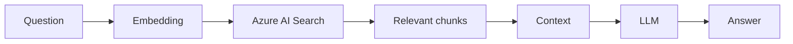

### Question 2 — entity-oriented retrieval

> **What was the name of the boss dwarf that contracted Bilbo for his adventure?**

This is useful because it is not simply a keyword lookup. The system has to retrieve context around the relevant entities and relationships.

### Question 3 — grounding / out-of-domain test

> **Who is Harry Potter?**

The knowledge base is about Middle-earth, not Harry Potter.

This is deliberately useful as a demo question: it lets me discuss **grounding and the limitations of a RAG system** rather than only demonstrating a successful retrieval.

---

# 5. Azure infrastructure

The infrastructure is defined in:

```text
terraform/
```

The main Azure resources are:

| Resource | Purpose |
|---|---|
| **Azure OpenAI** | LLM inference + embedding generation |
| **GPT-4o-mini deployment** | Answer generation |
| **text-embedding-3-small deployment** | Document/query embeddings |
| **Azure AI Search** | Vector + keyword retrieval |
| **Azure Key Vault** | Secrets and service endpoints |
| **Azure Storage Account** | Terraform state / infrastructure support |
| **Resource Group** | Azure resource organization |

At a high level:

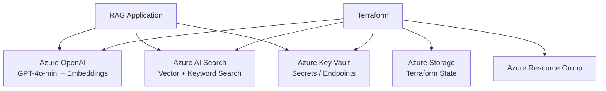

The Terraform configuration creates Azure OpenAI with separate deployments for embeddings and generation.

Azure AI Search is configured as the retrieval layer, with a Basic search service and a single replica/partition for this small-scale demo.

### Why Terraform?

The point is not simply:

> "I know Terraform."

The point is:

> **The environment is reproducible and infrastructure is treated as code rather than as a collection of manually-created Azure resources.**

That becomes increasingly important as an application moves from a demo towards multiple environments.

---

# 6. Security / secrets

Application secrets are not hardcoded into the RAG modules.

The application retrieves secrets through the central client layer, while Terraform provisions the relevant Key Vault secrets.

For example:

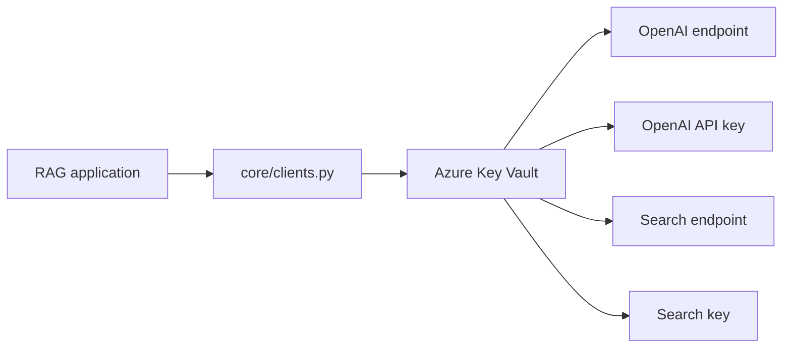

### Engineering principle

The application should depend on:

```text
"give me the secret I need"
```

rather than:

```text
"here is the secret"
```

That keeps credentials out of the application logic and makes the application configuration easier to manage.

---

# 7. RAG pipeline

The RAG implementation is deliberately separated into three major stages:

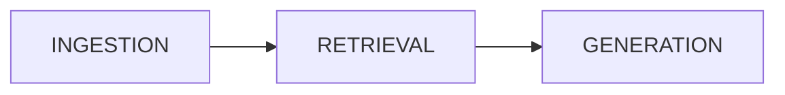

Each stage has its own module:

```text
rag_app/
├── ingestion/
├── retrieval/
└── generation/
```

---

## 7.1 Ingestion

The ingestion flow is:

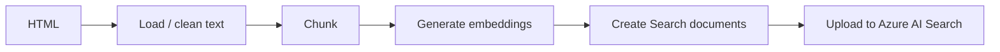

The orchestration lives in:

```text
rag_app/ingestion/ingest.py
```

The ingestion process loads each HTML document, chunks it, generates embeddings and uploads the resulting documents to Azure AI Search.

---

## 7.2 Chunking strategy

Chunking is intentionally isolated from the rest of ingestion.

```text
rag_app/ingestion/chunking.py
```

The strategy follows a simple hierarchy:

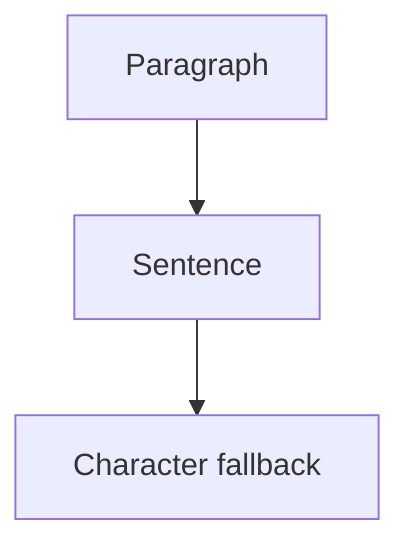

Long paragraphs are recursively split into smaller pieces, while the final chunks can retain overlap with the preceding chunk.

This is an example of keeping **configuration and strategy separate from orchestration**.

Instead of embedding chunking decisions throughout the ingestion code, ingestion simply receives a `ChunkingStrategy`.

That makes it easier to experiment with:

- chunk size
- overlap
- splitting strategy

without rewriting the ingestion pipeline.

---

# 8. Embeddings and indexing

Each chunk is converted into an embedding using the Azure OpenAI embedding deployment.

The embedding layer validates that:

- an input was provided
- the number of embeddings matches the number of inputs
- the returned embedding dimension matches the configured dimension

The resulting Search document contains both the original content and its vector:

```text
{
    chunk_id
    content
    contentVector
    source
    title
    chunk_index
    strategy_name
    content_hash
}
```

The Azure AI Search index defines a vector field named:

```text
contentVector
```

and configures vector search using an HNSW algorithm.

### Why keep the metadata?

The vector is useful for retrieval, but metadata is useful for everything around retrieval:

```text
content
source
title
chunk_index
strategy
hash
```

For example, after retrieving a chunk, the application can still explain:

> "This came from article X, chunk Y."

---

# 9. Incremental / idempotent ingestion

The ingestion pipeline also includes a simple deduplication mechanism.

Before processing a file:

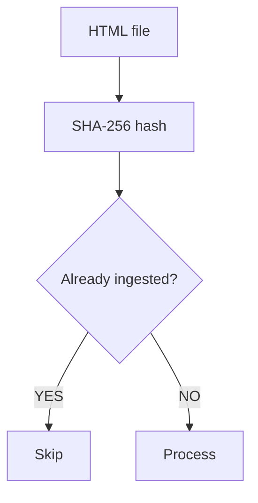

The ingestion metadata index stores:

```text
file_hash
strategy_name
embedding_model
source
ingested_at
```

The application checks these values before re-processing a file.

This is a small but important engineering detail.

A pipeline should not blindly regenerate embeddings every time it runs.

---

# 10. Retrieval

The retrieval path is:

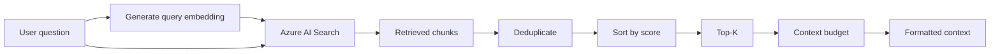

The active search implementation generates an embedding for the query and sends both:

- the original query as `search_text`
- the embedding as a vector query

to Azure AI Search.

This gives the system both:

**Semantic retrieval**

```text
"What happened to the dragon?"
```

and

**Keyword/entity matching**

```text
"Smaug"
"Bilbo"
"Thorin"
```

---

## Retrieval post-processing

Raw search results are not immediately passed to the LLM.

The retrieval layer performs several steps:

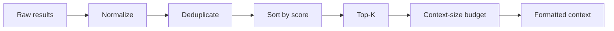

This is an important distinction:

> **Retrieval is not just "call vector search."**

There is application logic between the search engine and the LLM.

---

# 11. Generation

Once retrieval has produced the relevant context:

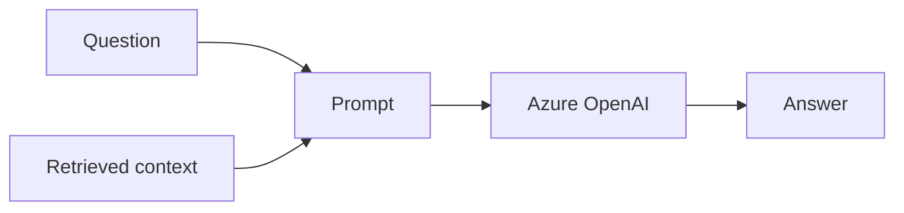

Generation is separated from retrieval under:

```text
rag_app/generation/
```

This keeps the LLM interaction independent from the mechanism used to find the supporting documents.

The architectural idea is:

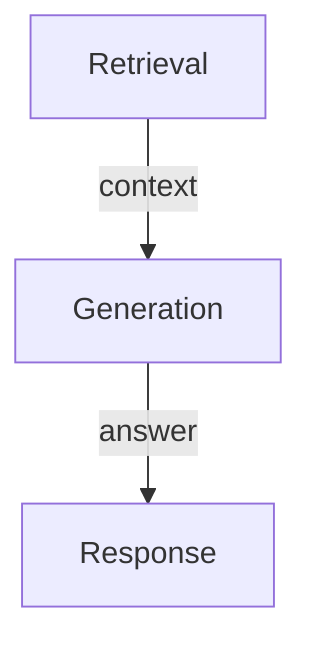

This separation would make it possible to change the retrieval implementation without redesigning the generation layer.

---

# 12. Project structure

```text
dabrm-rag_phase2_azure_iac/
│
├── data/
│   ├── README.md
│   └── sources/
│       └── wiki_urls.txt
│
├── frontend/
│   └── streamlit_app.py
│
├── loaders/
│   └── wiki_loader.py
│
├── rag_app/
│   │
│   ├── api/
│   │   └── app.py
│   │
│   ├── core/
│   │   ├── clients.py
│   │   ├── config.py
│   │   └── logging.py
│   │
│   ├── generation/
│   │   ├── generate.py
│   │   └── prompts.py
│   │
│   ├── ingestion/
│   │   ├── chunking.py
│   │   ├── create_index.py
│   │   ├── embeddings.py
│   │   ├── hashing.py
│   │   ├── indexing.py
│   │   └── ingest.py
│   │
│   └── retrieval/
│       ├── query_rewrite.py
│       ├── retrieve.py
│       └── search.py
│
├── terraform/
│   ├── openai.tf
│   ├── openai_deployment.tf
│   ├── search.tf
│   ├── key_vault.tf
│   ├── storage.tf
│   └── ...
│
└── requirements.txt
```

The structure mirrors the architecture:

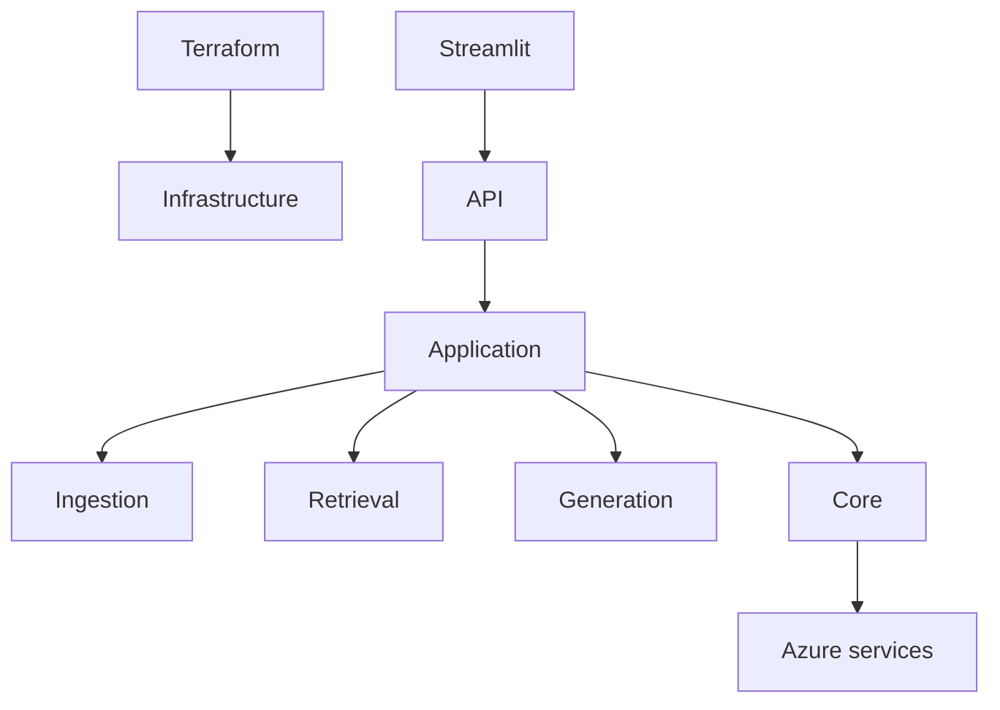

---

# 13. The main engineering decisions

For the interview, these are the decisions I would focus on rather than explaining every file.

### 1. Why RAG?

The LLM itself does not need to contain the domain knowledge.

Instead:

```text
Knowledge → Search
Reasoning / generation → LLM
```

This separates the knowledge layer from the model layer.

### 2. Why Azure AI Search?

It provides the retrieval infrastructure needed for the application, including vector search and traditional keyword search.

### 3. Why separate ingestion and retrieval?

Because they have different lifecycles:

```text
Ingestion → relatively infrequent

Retrieval → happens for every question
```

They therefore should not be coupled.

### 4. Why an API between GUI and RAG?

The GUI is a client, not the application itself.

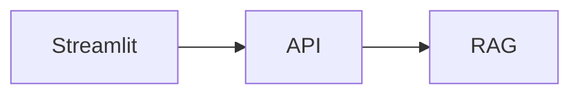

That means another client could be introduced without changing the core RAG pipeline.

### 5. Why Terraform?

To make the Azure environment reproducible and treat infrastructure as code.

### 6. Why Key Vault?

To separate secrets from application code and centralize access to credentials/endpoints.

### 7. Why hashing?

To make ingestion incremental rather than repeatedly processing identical files.

---

# 14. Interview walkthrough

The project can be presented in roughly this order:

### **01 — Motivation**

> "I wanted to demonstrate both AI/LLM skills and traditional Data/Cloud Engineering skills in one small project."

↓

### **02 — Data**

> "The knowledge base is deliberately small: a collection of Wikipedia articles about Middle-earth."

↓

### **03 — Live demo**

Ask two normal questions and one out-of-domain question.

↓

### **04 — Infrastructure**

Show:

```text
Azure OpenAI
Azure AI Search
Key Vault
Storage
Resource Group
```

Then explain what each resource contributes.

↓

### **05 — RAG pipeline**

Walk left-to-right:


↓

### **06 — Engineering principles**

Finish with:

> "The interesting part of this project isn't that it can answer questions about Tolkien. It's that the same application structure could be used with a different dataset and scaled into a different use case."

---

# 15. Quick reference

| Layer | Technology |
|---|---|
| Language | Python |
| API | FastAPI / OpenAPI |
| UI | Streamlit |
| LLM | Azure OpenAI — GPT-4o-mini |
| Embeddings | Azure OpenAI — text-embedding-3-small |
| Vector / keyword search | Azure AI Search |
| Secrets | Azure Key Vault |
| Infrastructure | Terraform |
| State | Azure Storage |
| Data | Wikipedia HTML |

---

# 16. Run locally

Install dependencies:

```bash
pip install -r requirements.txt
```

Make sure the Azure infrastructure and required secrets are available.

Create the Search indexes:

```bash
python -m rag_app.ingestion.create_index
```

Run ingestion:

```bash
python -m rag_app.ingestion.ingest
```

Start the API:

```bash
uvicorn rag_app.api.app:app --reload
```

Start the UI:

```bash
streamlit run frontend/streamlit_app.py
```

---

# 17. The one-minute version

> **This is a small RAG application built on Azure.**
>
> I deliberately kept the dataset small so that I could focus on engineering principles rather than building a large data platform.
>
> The documents go through an ingestion pipeline where they are loaded, chunked, embedded and indexed in Azure AI Search. At query time, the user's question is embedded and sent to Azure AI Search using vector and keyword retrieval. The best chunks are then assembled into a bounded context and passed to Azure OpenAI for generation.
>
> Around that core RAG flow, I separated the API, GUI, ingestion, retrieval, generation and infrastructure layers. Terraform provisions the Azure resources, while Key Vault handles the service credentials and endpoints.
>
> The main thing I wanted to demonstrate is that an AI application can still follow traditional engineering principles: **separation of concerns, reproducibility, security, incremental processing and clear interfaces between components.**

---

## Suggested interview architecture view

Rather than walking through individual Terraform files, show the architecture at the resource level:

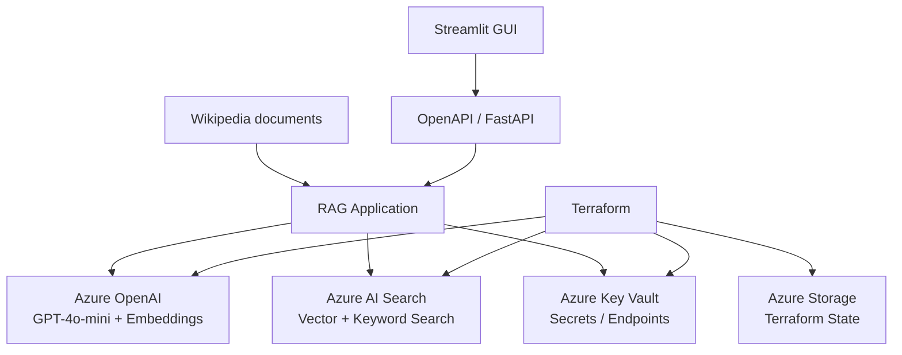

Then make the core interview message:

> **"I used a small RAG problem to demonstrate how I would engineer an AI system, rather than simply demonstrating an LLM call."**
